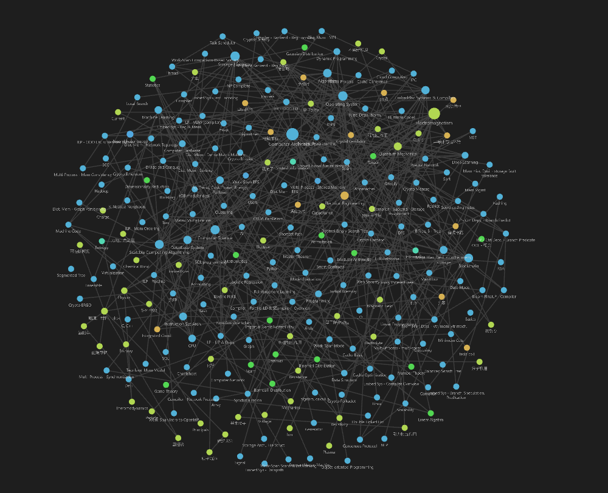

# 2ndBrain
 personal knowledge build

- **hzhaoc-f(x)**: knowledge notes
- **hzhaoc-y**: other notes
- **code/algo**: some notes for data structure & fun algo

## A graph view of my knowledge notes: 
