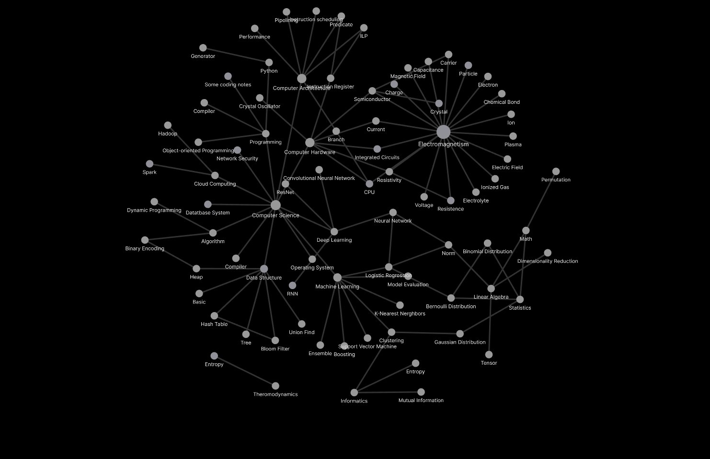

# 2ndBrain
 personal knowledge build

- **hzhaoc-f(x)**: knowledge notes
- **hzhaoc-y**: other notes
- **code/algo**: some learning notes of data structure and algorithms I learnt from various sources like [Coursera: Stanford Algirhtms](https://www.coursera.org/specializations/algorithms)

## A graph view of my knowledge notes: 
