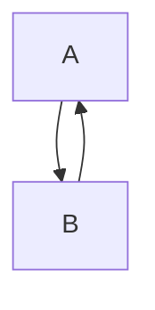

## Descriptions: 
A type of priority queue. 
## Property: 
Parent is bigger than its children
## Advantages:
- Efficient data structure when dealing with min/max due to $O(logn)$ operations in adding new item and/or extraction min/max.
## Code

## Applications
- Median Maintain
- Compute Minimum Distance (Dijkstra’s Algorithm)
- Compute Minimum Spanning Tree (Prim’s Algorithm)
