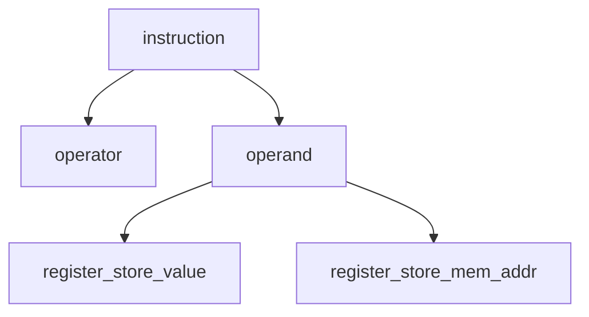

# Instruction
An instruction can be variable or fixed length, for RISC-V it is 32-bit fixed length. An instruction consists of [operators, operands], where operands consists of [registers, memory address].

# Instruction Set Architecture
In [[Computer Science]], an **instruction set architecture** (**ISA**) is an **abstract model** of a computer. It is also referred to as **architecture** or [[Computer Architecture]]. A realization of an ISA, such as a [[CPU]], is called an _implementation_. ISA serves as the boundary between hardware and software.

In general, an ISA defines 
-	supported data types
-	[[Storage Hierarchy#Instruction Register|register]]
-	hardware support for managing [[Storage Hierarchy#RAM DRAM|main memory]]
-	fundamental features (such as the [memory consistency](https://en.wikipedia.org/wiki/Memory_consistency "Memory consistency"), addressing modes, [virtual memory](https://en.wikipedia.org/wiki/Virtual_memory "Virtual memory"))
-	input/output model of a family of implementations of the ISA.

An ISA specifies the behavior of [[Machine Code]] running on implementations of that ISA in a fashion that does not depend on the characteristics of that implementation, providing binary compatibility between implementations. This enables multiple implementations of an ISA that differ in [[Arch. - Performance]], physical size, and monetary cost (among other things), but that are capable of running the same machine code, so that a lower-performance, lower-cost machine can be replaced with a higher-cost, higher-performance machine without having to replace software. It also enables the evolution of the microarchitectures of the implementations of that ISA, so that a newer, higher-performance implementation of an ISA can run software that runs on previous generations of implementations.

If an [[Operating System]] maintains a standard and compatible [application binary interface](https://en.wikipedia.org/wiki/Application_binary_interface "Application binary interface") (ABI) for a particular ISA, machine code for that ISA and operating system will run on future implementations of that ISA and newer versions of that operating system. However, if an ISA supports running multiple operating systems, it does not guarantee that machine code for one operating system will run on another operating system, unless the first operating system supports running machine code built for the other operating system.

An ISA can be extended by adding instructions or other capabilities, or adding support for larger addresses and data values; an implementation of the extended ISA will still be able to execute machine code for versions of the ISA without those extensions. Machine code using those extensions will only run on implementations that support those extensions.

The binary compatibility that they provide make ISAs one of the most fundamental abstractions in computing.

### Class of ISA
nearly all ISA are classified as general-purpose register architectures, where operands are either **registers or memory locations**. *Register-memory* ISA such as 80x86 can access memory as part of instructions, whereas *load-store* ISA such as RISC-V, ARMv8 can access memory only with load or store instructions.

### Memory addressing
virtually all all desktop and server computers including 80x86, RISC-V, ARMv8, use **byte addressing** to access memory operands. Some architectures lick ARMv8 requires objects be **word-aligned**; 80x86, RISC-V do not but if it works faster if word-aligned.

### Addressing modes
RISC-V addressing modes are Register, Immediate (for constants), Displacement.