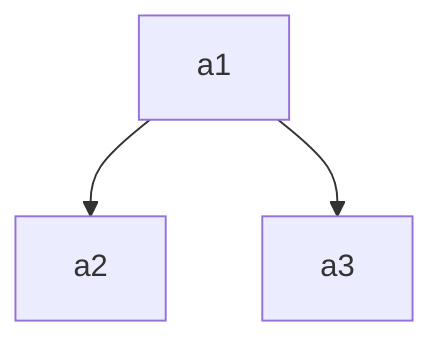
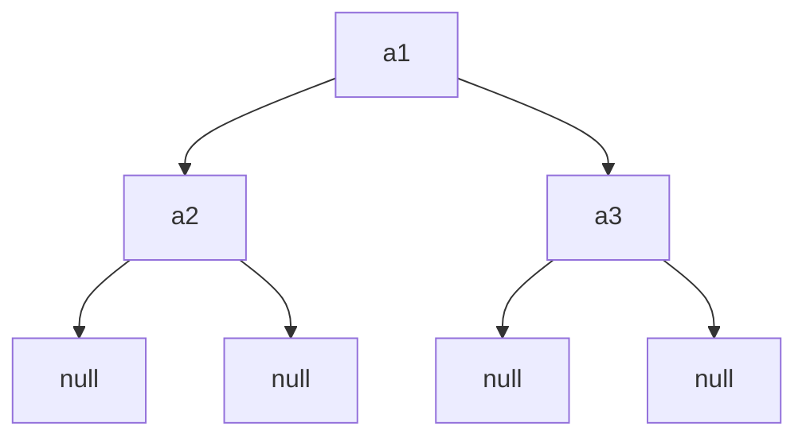

### Concept
for a set of numbers $a_1, a_2, ..., a_n$ and its frequencies $f_1, f_2, ..., f_n$, its constructed **Optimal Binary Search Tree** (sometimes called Weight-Balanced Binary Search Tree because it accounts for element weight/frequency/cost) is a binary search tree that maintains following property:
- left child value is smaller than parent value; right child value is bigger than parent value;
- total cost is optimal (cost for one node is its depth times its frequency)

### Why OBST?
Optimal Binary Search Tree in principal is a sorted array. It is fast at **element lookup in a set**.

### Tree Creation Algorithm
##### with successful search only
Consider a tree whose general structure like follow:


Let a series of set element be $a_1, a_2, ..., a_n$, their frequencies be $f_1, f_2, ..., f_n$, and 2 2-D arrays be $A$, $F$ where $A_{i, j}$, $F_{i, j}$ is the respectively the structure and minimum total frequencies for a Optimal Binary Tree consisting of elements $a_i, a_{i+1}, ..., a_j$ ($i<=j$). 

To divide the problem into sub-problems, notice for OBST $A_{i, j}$, it should be in a structure where root node is $a_k$, left child is $A_{i, k-1}$, and right child is $A_{k+1, j}$. 

> Why left child and right child are still optimal sub tress? 
> For a optimal binary search tree $A_{i, j}$ with root $a_k$, if its right child node is not $A_{k+1, j}$, then there exists a better sub-tree, $A_{k+1, j}$, that makes total cost of $A_{i, j}$ less. Therefore the left child must be optimal sub tree. Same for right child.

Then for each tree $A_{i, j}$, and its cost $F_{i, j}$, we know ($F_{x, x-1}=0$) 

$$F_{i,j}=\min_{\forall{k}\in{[i,...,j]}}\{F_{i,k-1}+F_{k+1,k}+\sum_{l=i}^{j}{f_l}\}$$

When a $k$ is solved for each pair of $i, j$, the $k$ is the root value for the Optimal Binary Search Tree $A_{i, j}$. After we solve each root value for all $A_{i, j}$, we can break down any optimal binary search tree $A_{i, j}$'s structure from top to bottom. 

##### with successful & unsuccessful search
now consider also unsuccessful search like following:

Null nodes are unsuccessful searches. For an OBST with N internal nodes (for successful searches), there are N+1 null nodes (for unsuccessful searches). The rules to divide the tree construction problem into subproblems that we noticed remain the same. That is:

for each tree $A_{i, j}$, and its cost $F_{i, j}$, we know ($F_{x, x-1}=0$) 

$$F_{i,j}=\min_{\forall{k}\in{[i,...,j]}}\{F_{i,k-1}+F_{k+1,k}+\sum_{l=i}^{j}{f_l}+\sum_{m=i}^{j+1}{f'_m}\}$$

where there's an additional sum term for $f'_m$, $m\in{[i, j+1]}$ which is sum of frequency for all **Null Nodes**. 


### Code Implementation
we can use [[Dynamic Programming|dynamic programming]] to construct an Optimal Binary Search tree for $\{a_1, a_2, ..., a_n\}$ and calculate its cost. The pseudo code is:
```C
for {d=0; d<=n; d++}{
	for {i=0; i<=n-d; i++}{
		// F[i][j] is total cost for OBST consisting elements {ai,..,aj}. F[X][X-1]=0. 
		// Could use extra space to denote F[x][x] as 0 (no element) and F[x][x+1] as total frequency of elements {x}
		// W[i][j] is total frequency for elements  {ai,...,aj}. It includes Null Nodes if uncessful searches are considered and corresponding frequencies are given.
		F[i][i+d] = min{F[i][k-1] + F[k+1][i+d]} + W[i][j] for any k in {i, ..., i+d}
		A[i][i+d] = optimal k // root element number for this tree cosisted of elments {i, i+1, ..., i+d}
	}
}
```

- Time Complexity: $O(n^3)$
- Space Complexity: $O(n^2)$

### OBST vs B/B+ tree, Huffman Codes
##### OBST vs B/B+ tree
First of all, B tree is a M-way tree, it can have more than 2 child nodes for each node. The similarity is that during an element search down the tree, node value is being compared to determine where to go down the path. B/B+ tree is commonly used in multi-level indexing database system where a search/query can quickly locate the searched element's address in hard disk. OBST can be used where one needs a data structure that supports fast array element lookup.

##### OBST vs Huffman Codes
First, the objectivity is totally different: OBST is for quick set element lookup whereas Huffman Codes are for efficient data encoding such as file compression. In other words, Huffman Codes encode a series of characters/elements, or an array, into binary codes where total numbers of binary digits needed are at optimal/minimum. Huffman Codes is not for quick array element search which is OBST's purpose.

### More on OBST
> In the static optimality problem, the tree cannot be modified after it has been constructed. In this case, there exists some particular layout of the nodes of the tree which provides the smallest expected search time for the given access probabilities. Various algorithms exist to construct or approximate the statically optimal tree given the information on the access probabilities of the elements.
> 
> In the dynamic optimality problem, the tree can be modified at any time, typically by permitting tree rotations. The tree is considered to have a cursor starting at the root which it can move or use to perform modifications. In this case, there exists some minimal-cost sequence of these operations which causes the cursor to visit every node in the target access sequence in order. The splay tree is conjectured to have a constant competitive ratio compared to the dynamically optimal tree in all cases, though this has not yet been proven.

### Uses
- general dictionary (Not Python dict...)
- ASCII or other code lookup?